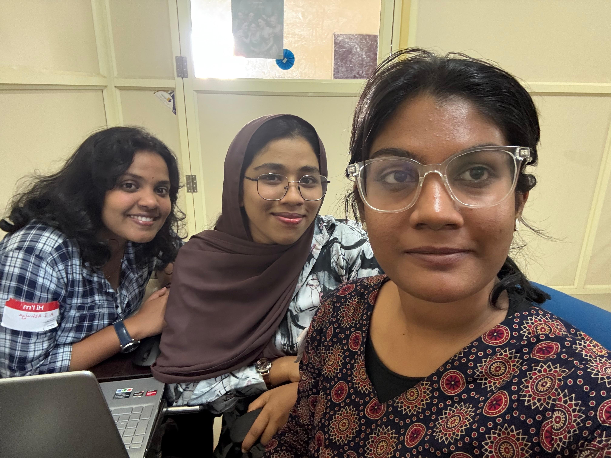

# [STUDENT_BUDGET] 🎯

## Basic Details
### Team Name: [INNOVATEHER]

### Team Members
- Member 1: [A.J.ATHULYA] - [College of Engineering And Management,Punnapra]
- Member 2: [Arsha Fathima] - [College of Engineering And Management,Punnapra]
- Member 3: [Sherin Ebadhi] - [College of Engineering And Management,Punnapra]

### Hosted Project Link
[mention your project hosted project link here]

### Project Description
[The Student Budgeting Web Application is a Django-based tool designed to help students manage their finances. It enables users to record income and expenses, set budget goals, and generate financial reports, promoting informed financial decisions.]

### The Problem statement
[Many students face challenges in managing their finances effectively, leading to overspending and financial stress. This project aims to address this issue by providing a web-based application that assists students in tracking income and expenses, setting budget goals, and generating financial reports, thereby promoting informed financial decision-making.]

### The Solution
[A web student budget helps students track income,manage expenses,and set savings goals,making budgetting simple and effective]

## Technical Details
### Technologies/Components Used
For Software:
- [HTML,CSS,Django]
- [Django]
- [Tailwind CSS,HTMX,Alpine.js,Chart.js]
- [Integrated Development Environments (IDEs),Version Control Systems, Database Management Tools,Code Quality and TestingTask and Dependency Management,Debugging and Performance Monitoring]
Task and Dependency Managemen
For Hardware:
### Implementation
For Software:HTML,CSS,Django
# Installation
[commands]

# Run
[commands]

### Project Documentation
For Software:The Student Budgeting Web Application is a Django-based tool designed to help students manage their finances. It allows users to record income and expenses, set budget goals, and generate financial reports. The application promotes financial literacy by providing insights into spending habits and encouraging disciplined financial planning.

# Screenshots (Add at least 3)
%20-%20Copy.png)
Add caption explaining what this shows

.png)
Add caption explaining what this shows

%20-%20Copy.png)
Add caption explaining what this shows

# Diagrams

Add caption explaining your workflow

For Hardware:

# Schematic & Circuit

Add caption explaining connections

Add caption explaining the schematic

# Build Photos

List out all components shown

Explain the build steps

Explain the final build

### Project Demo
# Video
[Add your demo video link here]
Explain what the video demonstrates

# Additional Demos
[Add any extra demo materials/links]

## Team Contributions
- [Name 1]: [Specific contributions]
- [Name 2]: [Specific contributions]
- [Name 3]: [Specific contributions]

---
Made with ❤ at TinkerHub